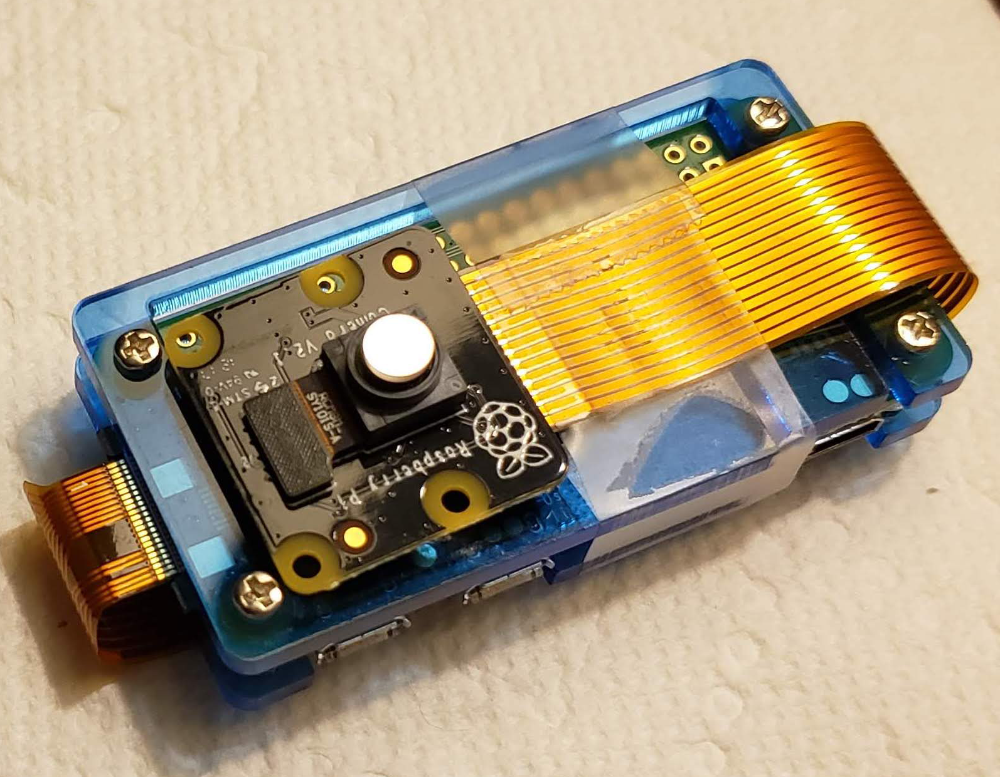
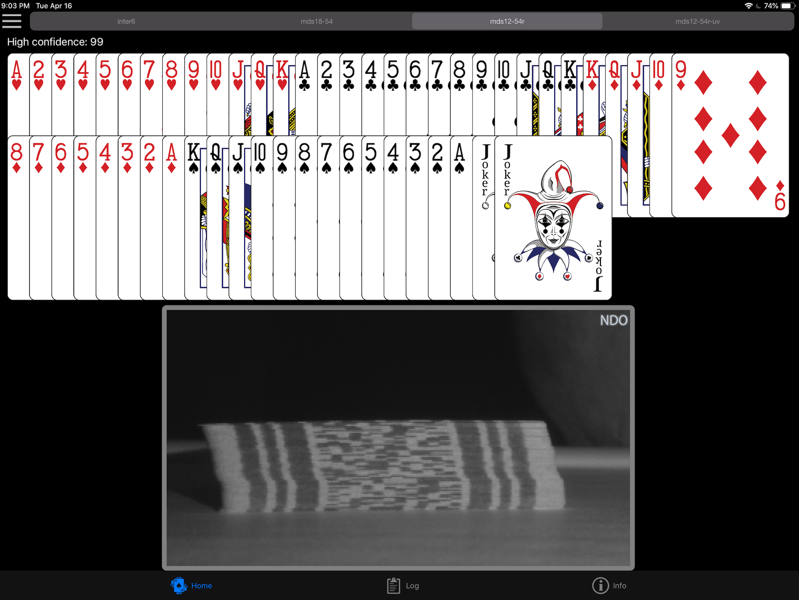
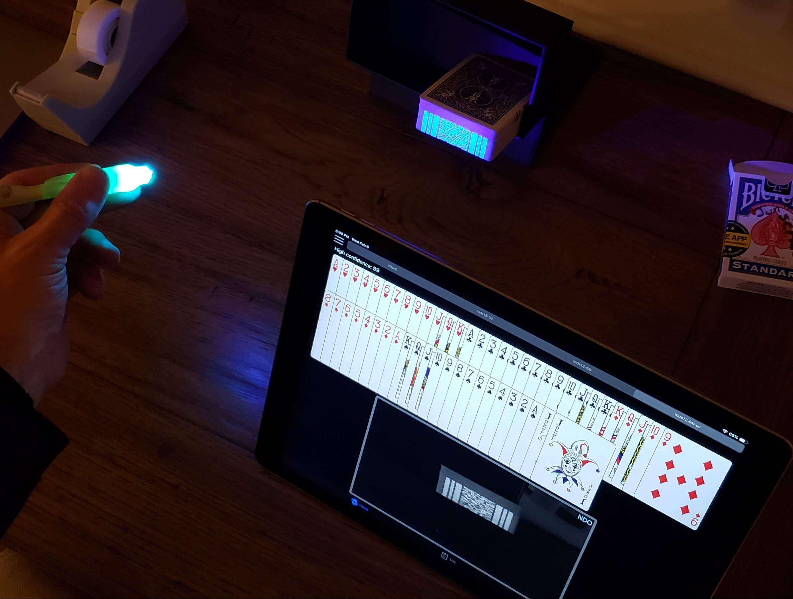
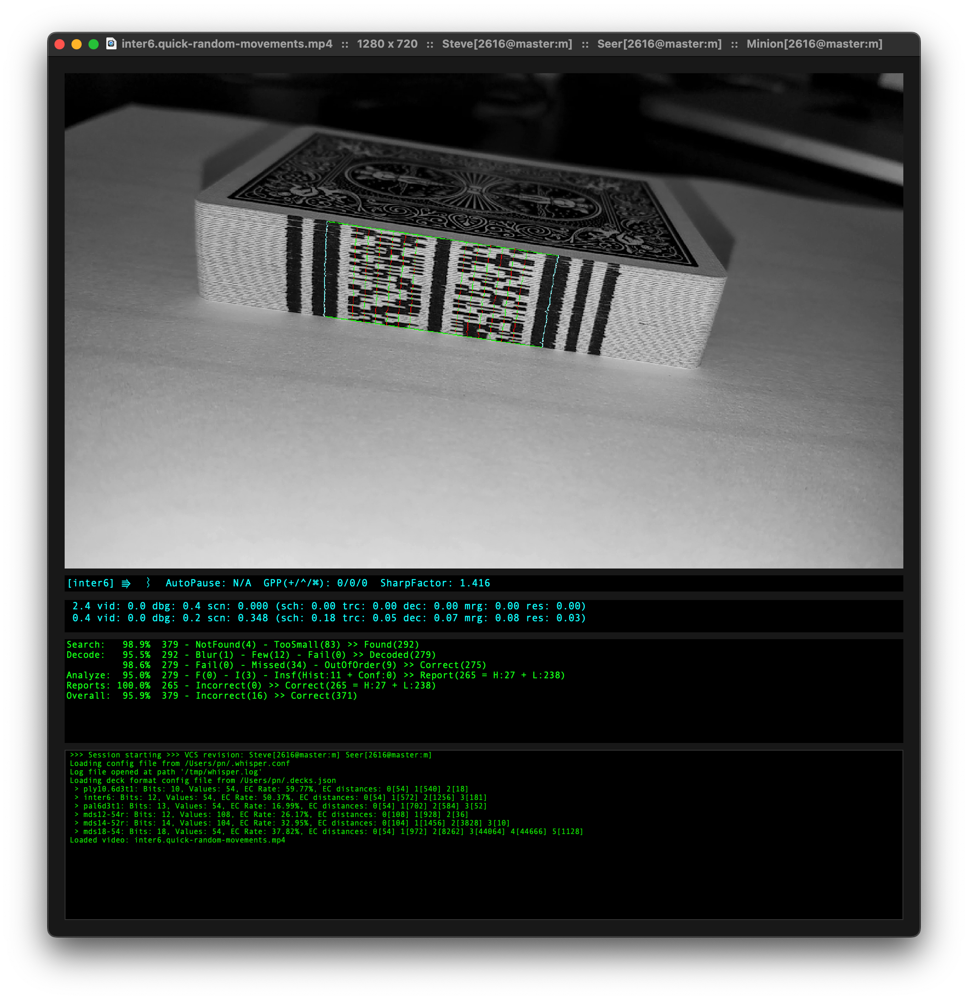
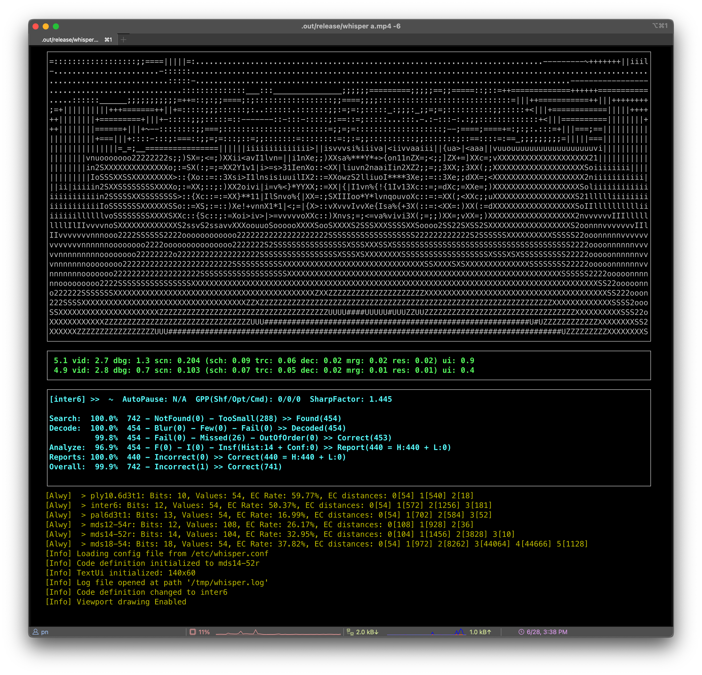

# The Nettle Magic Project

This deck of cards has a bar code printed on the edge of each card. Scanning these bar codes would reveal where every card is (or isn't - if cards are missing.)

Think card magic.

This wouldn't be a very good magic trick if you could see the marks. We need invisible marks.

One of these decks is unmarked, the other is marked with this special ink that is only visible under specific IR conditions.

This device (a Raspberry Pi Zero W with a NoIR camera) can see these marks. The shiny circle is a special IR filter.

A scanning server runs on this small device.

This is Abra, the iOS client application running on my iPad. It shows what the server's camera sees along with the decoded deck. As you can see, the IR marks are quite visible to the camera.

Your iDevices can also be a server, but they can't see those infrared marks, even with special filters. However, they can see black ink marks and marks made using a different type of invisible ink - ultraviolet fluorescing ink.

For hard core developers, I've included the testbed, which has a bunch of visualization tools to understand how things work.

The testbed only runs on Mac. However, the server app is a generic Linux console app and it includes a text-based GUI mode.

Performance is critical.

The statistical model requires a full 30Hz of data. Also, this can be strapped to a person's body during a performance. Efficiency means longer battery, less heat.

It can scan/decode a 1080p image to an ordered deck in as little as 4ms. On a rPI.

# Get started

Full documentation is available [here](https://nettlep.github.io/magic/).
